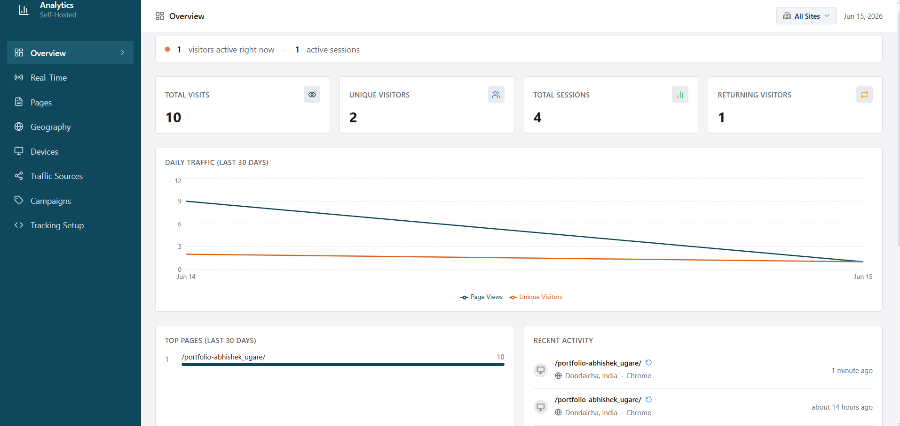
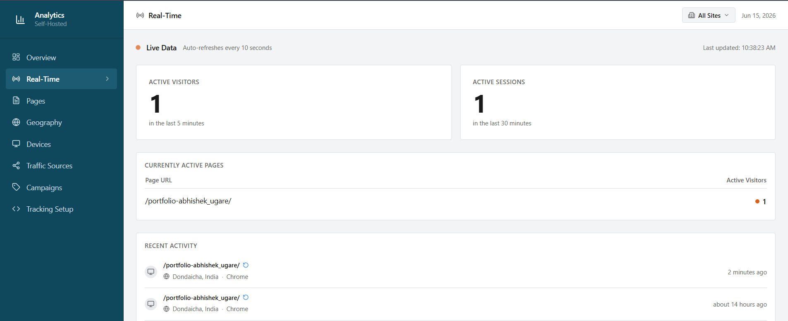
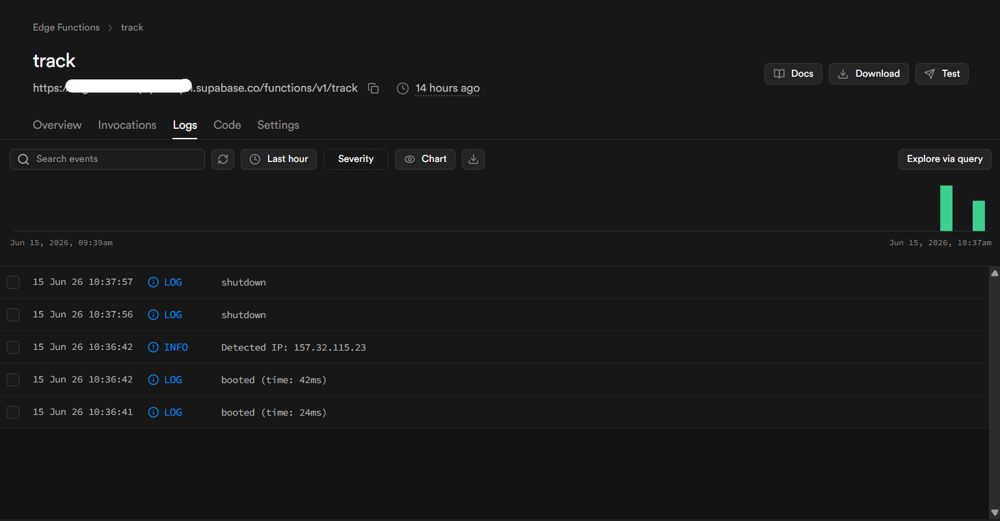

# 📊 Analytical Dashboard

A real-time analytics and traffic monitoring system designed to track, manage, and visualize website user activity through an interactive dashboard.

## 📖 About the Project

**Analytical Dashboard** is a full-stack web application developed to monitor website traffic and user interactions in real time.  
The system provides live analytics, user activity tracking, and data visualization through a modern dashboard interface.

This project focuses on helping administrators understand:
- Website traffic behavior
- Real-time user activity
- Visitor insights and analytics
- System monitoring and management

The project was built to strengthen understanding of:
- Real-time data tracking
- Full-stack dashboard architecture
- Authentication and database integration
- Analytics visualization systems

## 🚀 Live Demo 
🚧 Currently running locally / on Vite development server

## 📸 Screenshots

### Dashboard Overview

### Real-Time Traffic Monitoring

### Database Activity Panel

## ✨ Features
- Real-time website traffic monitoring
- Live user activity tracking
- Interactive analytics dashboard
- Responsive and modern UI
- Authentication system
- Supabase database integration
- Scalable React component architecture

## 🛠️ Tech Stack
- **React** – Frontend framework  
- **TypeScript** – Type-safe development  
- **Vite** – Fast build tool  
- **Supabase** – Backend & database services  

## 🚀 How to Run Locally
Install dependencies (run once after cloning)

      npm install     
     
Start local development server

      npm run dev  

Build production-ready files into dist/

      npm run build  

Check code for errors

      npm run lint         

For detailed information view [HOW_TO_RUN_LOCALLY.txt](HOW_TO_RUN_LOCALLY.txt)

## 🌐 How to Add Website
Your personal tracking endpoint (where data is sent) is:

  https://YOUR_SUPABASE_PROJECT.supabase.co/functions/v1/track

Replace "YOUR_SUPABASE_PROJECT" with your actual Supabase project reference.
You can find it at: Supabase Dashboard → Settings → General → Reference ID

For example, if your project ref is "abcdefghijklmno", your endpoint is:
  https://abcdefghijklmno.supabase.co/functions/v1/track

Keep this URL handy — you'll use it below.

━━━━━━━━━━━━━━━━━━━━━━━━━━━━━━━━
### PLAIN HTML WEBSITE (Most Common)
━━━━━━━━━━━━━━━━━━━━━━━━━━━━━━━━

Add ONE line to each HTML page you want to track.
Place it just before the closing </body> tag.

  
                                                                  
    </body>                                                                 

That's it! Every page with this snippet will be tracked.

For detailed information view [HOW_TO_ADD_WEBSITE.txt](HOW_TO_ADD_WEBSITE.txt)

## 👨‍💻 Designed By                             
Abhishek Ugare                                               
Email: abhishekugare1289@gmail.com                                
LinkedIn: www.linkedin.com/in/abhishek-ugare-a289s85k                    
Portfolio: https://abhi8hero.github.io/portfolio-abhishek_ugare/
